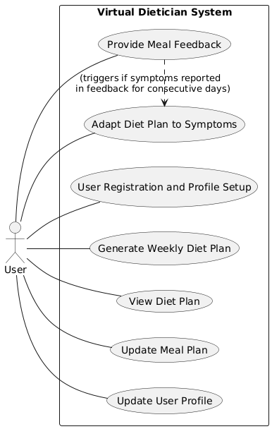

# Software Requirements Specification

# Brief Problem Statement

The project aims to develop a Virtual Dietician Cloud Native Application. This application will leverage Generative AI (GenAI) to create personalized weekly diet plans based on individual user requirements such as height, age, dietary restrictions, and other specific needs. The system will also dynamically adjust these plans to compensate for missed meals and incorporate user feedback regarding adverse symptoms to ensure nutritional goals are met and well-being is maintained.

# System Requirements

1) Cloud Native Application  
2) Event Driven Service-Oriented Architecture  
3) Made up of different Microservices

# Users profile

1) Health-conscious individuals  
2) Individuals with specific dietary restrictions

# Feature requirements 

| No. | Use Case Name | Description |
| :---- | :---- | :---- |
| 1 | User Registration and Profile Setup | User creates an account and provides personal details (height, age, weight), dietary preferences, restrictions, activity level, and health goals. |
| 2 | Generate Weekly Diet Plan | System uses GenAI to generate a personalized weekly diet requirements plan based on the user's profile and requirements. |
| 3 | View Diet Plan | User can view their current weekly diet plan, including meal details, nutritional information.. |
| 4 | Update Meal Plan | If a user misses a meal (e.g., due to fasting) or has some new requirement (e.g., Vegetarian diet), the system uses GenAI to dynamically adjust subsequent diet requirements in the weekly plan to ensure adequate nutrition. |
| 5 | Food Plate / Meal Recommendation | Provides Food Plate Recommendation taking into account User Symptoms and Diet Nutritional Requirements |
| 6 | Provide Meal Feedback | User provides feedback on meals (e.g., liked, ok, disliked). |
| 7 | Adapt Diet Plan to Symptoms | If a user reports adverse symptoms for consecutive days (e.g., two days), the system prompts for specific symptoms and uses GenAI to update the diet plan accordingly (e.g., identify potential lactose intolerance and modify plan). |
| 8 | Update User Profile | User can update their personal details, dietary preferences, restrictions, and health goals at any time. |

# Use Case Diagram

# Use Case Descriptions

| Use Case Number: | UC-01 |
| :---- | :---- |
| Use Case Name: | User Registration and Profile Setup (Basic Details, Home Location, Food Preferences, Cultural / Religious preferences,  Allergies if any, Health conditions if any, Diet/Nutrition Goals if any) |
| Overview | Allows a new user to create an account and input their personal and dietary information necessary for generating a personalized diet plan.   |
| Actors | User  |
| Pre condition: | User has access to the application |
| Flow: | Main (success) Flow: User opens the application and selects the "Register" option. User provides required registration details (e.g., email, password). System validates the details and creates a new user account. User is prompted to set their profile by entering: Personal information (height, age, current weight, gender). Dietary restrictions (e.g., allergies like nuts, soy; preferences like vegetarian, vegan). Health goals (e.g., weight loss, muscle gain, maintenance). Activity level. Any other relevant health conditions or requirements. System saves the profile information. System confirms that the profile has been successfully created/updated.  |
|  | a) User enters invalid email i) System displays an error message and prompts the user to enter a valid email. b) User enters mismatched passwords i) System displays an error message.       4\.   a) Some fields are incomplete when submitting                         i) System may prompt the user to complete missing mandatory fields before proceeding. |
| Post condition: | User account is created, and their profile information is stored in the system, ready for diet plan generation. |

| Use Case Number: | UC-02 |
| :---- | :---- |
| Use Case Name: | Generate Periodic (Weekly) Diet Plan |
| Overview | The system generates a personalized weekly diet plan for the user based on their stored profile information and requirements, utilizing GenAI..  |
| Actors | User, System |
| Pre condition: | User has set the diet plan generation profile |
| Flow: | Main (success) Flow: User selects “Generate Diet Plan” System retrieves the user's latest profile information (height, age, dietary restrictions, goals, etc.). System sends the user's requirements to the GenAI module. The GenAI module processes the requirements and generates a balanced, personalized weekly diet plan. System receives the generated diet plan from the GenAI module. System stores the diet plan and makes it available to the user.  |
|  | Alternate Flow: a) GenAI service encounters an error or is unavailable. System informs the user: "We are currently unable to generate your diet plan. Please try again later." |
| Post condition: | A new weekly diet plan is generated and accessible to the user |

| Use Case Number: | UC-03 |
| :---- | :---- |
| Use Case Name: | View Diet Plan \- Day specific  |
| Overview | The system displays the personalized weekly diet plan generated for the user.  |
| Actors | User, System |
| Pre condition: | User has generated a weekly diet plan |
| Flow: | Main (success) Flow: The system retrieves the user’s diet plan The system display the (food items) diet requirements as per each meal of the day for each day of the week to the user  |
|  | Alternate Flow:   a) System encounters an error while trying to retrieve or display the diet plan.     System displays a generic error message: "Unable to load your diet plan at the moment. Please try again." a) No diet plan is currently available for the user. System displays a message: "No diet plan available. Would you like to generate one now?" and provides an option to navigate to UC-02. |
| Post condition: | The User is able to see and review generated Diet Plan |

| Use Case Number: | UC-04 |
| :---- | :---- |
| Use Case Name: | Update Diet Plan (as per changed circumstances) |
| Overview | If a user misses a meal (e.g., due to fasting) or has some new requirement (e.g., Vegetarian diet), the system uses GenAI to dynamically adjust subsequent meals in the weekly plan to ensure adequate nutrition.  |
| Actors | User, System |
| Pre condition: | User is logged in. User has an active weekly diet plan. User has missed a scheduled meal or a changed requirement.  |
| Flow: | Main (success) Flow: User selects “Update Meal Plan” User is prompted to inform about missed meals or other requirement changes The User’s current diet plan and missed meal and updated requirement information are sent to GenAI to be updated The updated meal plan is received and displayed  |
|  | Alternate Flow: A. GenAI service is unavailable System informs the user that automatic adjustment is currently not possible and suggests retrying later.  The plan remains unadjusted. |
| Post condition: | The meal plan is updated to compensate for User’s requirements. |

USE CASE \- NEW \-05

Food Plate / Meal Recommendation  

| Use Case Number: | UC-06 |
| :---- | :---- |
| Use Case Name: | Provide Food Plate / Meal Feedback (Actual Meal specific BF  / Lunch / Dinner) |
| Overview | User provides feedback on meals (e.g., liked, ok, disliked). |
| Actors | User, System |
| Pre condition: | User is logged in. User has viewed or consumed a meal from their diet plan.  |
| Flow: | Main (success) Flow: User navigates to the specific meal in their diet plan or meal history. User selects an option to provide feedback for that meal. User inputs their feedback (e.g., selects "liked", “ok” and  "disliked”). If feedback is negative, system prompts user to comment on what they disliked about the meal User submits the feedback. System records the feedback and associates it with the specific meal and user. System confirms to the user that the feedback has been saved.  |
|  | Alternate Flow a) Network error occurs during submission of feedback. System displays an error message: "Unable to save your feedback due to a network issue. Please try again." The feedback is not saved. |
| Post condition: | User's feedback on a specific meal is recorded in the system. This feedback may be used by GenAI in future plan generations or adjustments. |

| Use Case Number: | UC-07  |
| :---- | :---- |
| Use Case Name: | Adapt Diet Plan to Symptoms / Special Needs Meal Plan |
| Overview | If a user reports adverse symptoms for consecutive days (e.g., two days), the system prompts for specific symptoms and uses GenAI to update the diet plan accordingly (e.g., identify potential lactose intolerance and modify plan). |
| Actors | User, System |
| Pre condition: | User is logged in. User has reported adverse symptoms via UC-05 for a defined consecutive period (e.g., two days). The system has an active diet plan for the user.  |
| Flow: | Main (success) Flow: If the system detects multiple negative feedbacks with symptoms in comments, it prompts GenAI with comments to find possible causes of symptoms. System informs User of the potential dietary restrictions and informs User to consult a healthcare professional and asks User if they would like to change diet plan based on the potential restrictions. Upon User confirmation, System updates diet plan to incorporate the potential dietary restrictions  |
|  | Alternate Flow: A. User opts to not change diet plan Diet plan unchanged by the system   |
| Post condition: | The user's diet plan is updated by GenAI in an attempt to mitigate the reported adverse symptoms, or the user is guided towards seeking medical attention. |

| Use Case Number: | UC-07 |
| :---- | :---- |
| Use Case Name: | Update User Profile / Preferences / Experiences  |
| Overview | User can update their personal details, dietary preferences, restrictions, and health goals at any time. |
| Actors | User, System |
| Pre condition: | User is logged in.  |
| Flow: | Main (success) Flow: User navigates to the "Profile" or "Settings" section of the application. User selects the option to edit their profile information. System displays the current profile information including: Personal information (height, age, current weight, gender). Dietary restrictions (e.g., allergies, preferences like vegetarian, vegan). Health goals (e.g., weight loss, muscle gain, maintenance). Activity level. Any other relevant health conditions or requirements. User modifies any of the desired fields. User confirms and saves the changes. System validates the updated information (e.g., data types, required fields). System stores the updated profile information. System confirms to the user that their profile has been successfully updated.  |
|  | Alternate Flows: a) User enters invalid data for one or more profile fields (e.g., non-numeric age, text in weight field, date in incorrect format). System highlights the field(s) with invalid data and displays specific error messages (e.g., "Age must be a number," "Please enter weight in kg.").  The profile is not saved until corrections are made. b) Network error occurs while attempting to save the updated profile. System displays an error message: "Your profile could not be updated due to a network error. Please check your connection and try again." The changes are not saved. |
| Post condition: | The updated User Profile is ready for diet plan generation |
